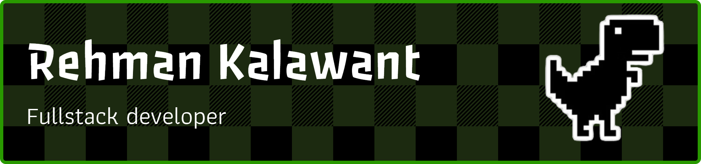

<!-- BANNER GIF -->

    

 

<!-- Get in Touch -->

    &nbsp;&nbsp;
    &nbsp;&nbsp;
    &nbsp;&nbsp;
    

---

 

<!--TECHSTACK WITH IMAGE ICONS ADDED HERE -->

### ⚙️ TECH STACK

<!--  -->

---

 

<!-- GitHub Card -->

  

 
    

 

